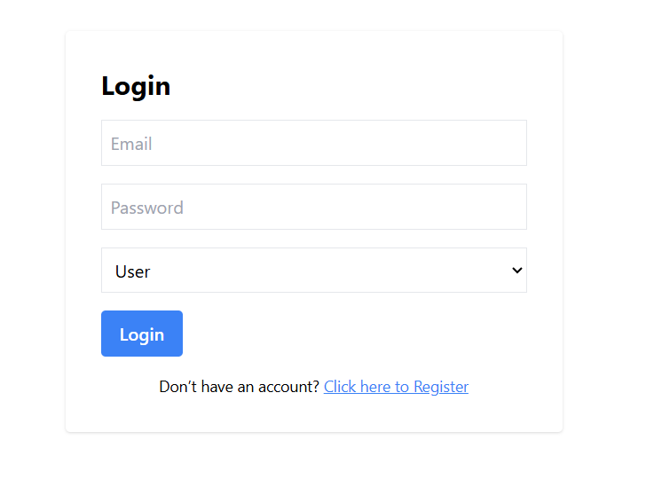
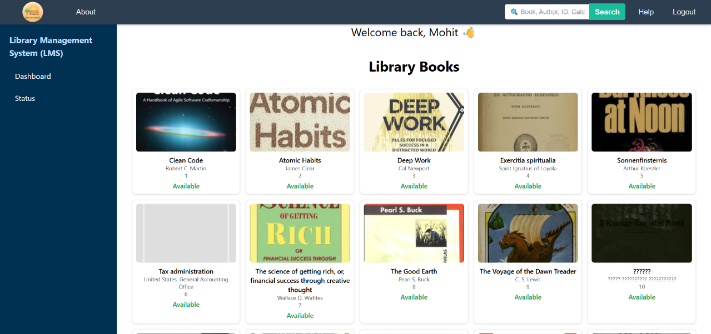
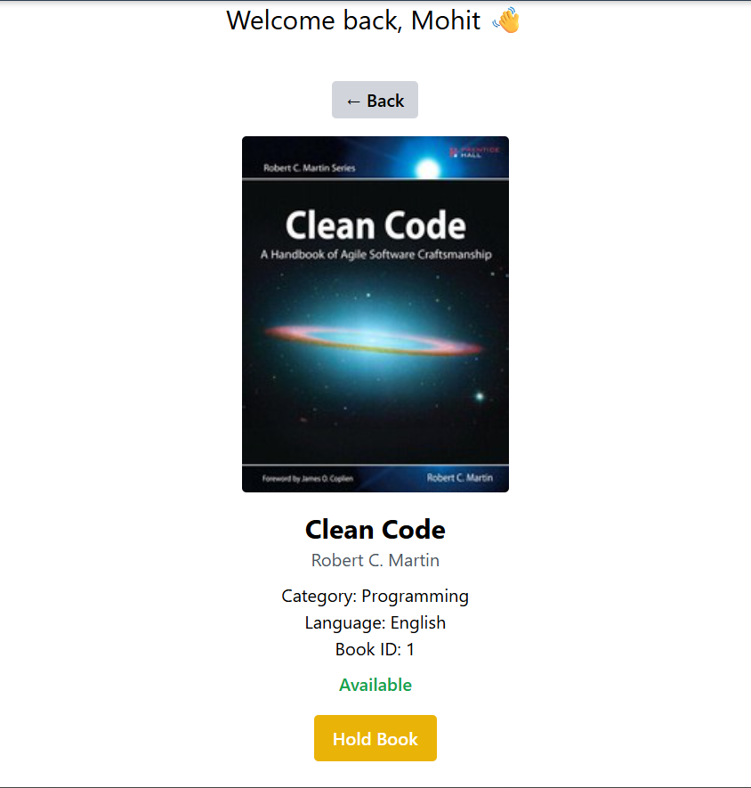
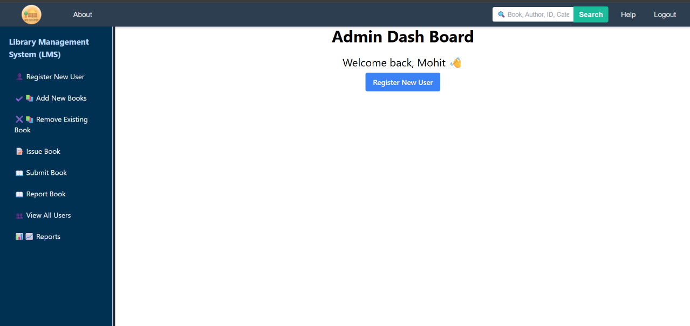
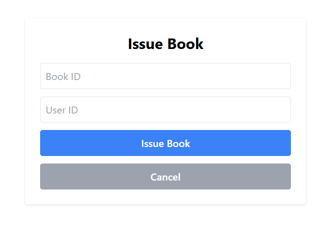
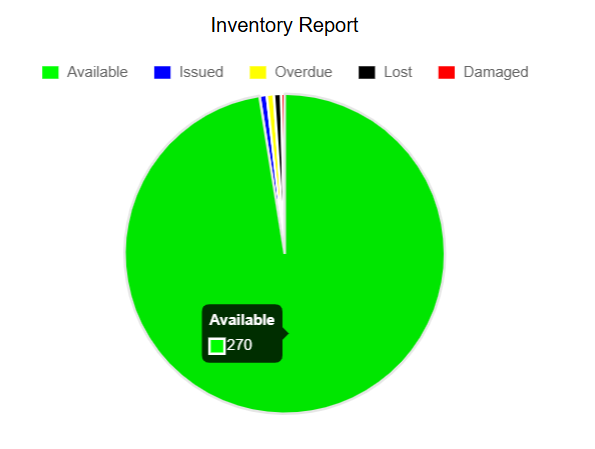
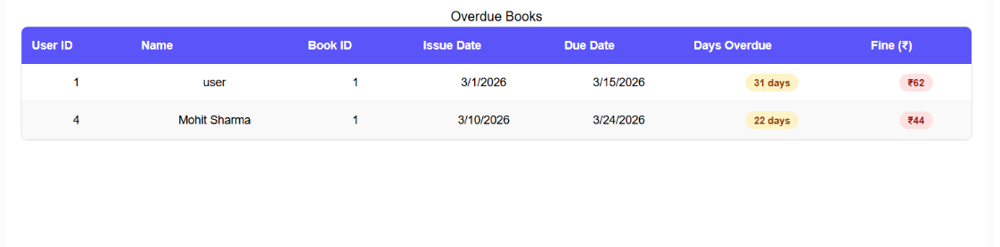
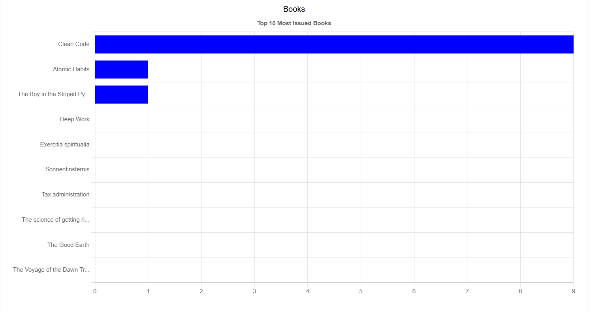

# 📚 Library Management System

### Full-Stack Library Automation & Analytics Platform

A modern web-based Library Management System built using **React, TypeScript, Node.js, Express.js, and MySQL**.

The platform automates library operations including book management, issue/return tracking, reservations, user management, and analytics through an intuitive web interface.

---

## 🚀 Overview

Traditional library systems often rely on manual record keeping, making it difficult to efficiently track books, users, transactions, and overdue records.

This Library Management System provides a centralized digital solution that simplifies library operations while offering advanced reporting and visualization features. The system supports both administrators and users through role-based access control and interactive dashboards.

In addition to standard library functionalities, the application includes analytics modules that provide insights into inventory status, user activity, popular books, and overdue records.

---

## ✨ Key Features

### 🔐 Authentication & Authorization

* User Registration
* User Login
* JWT Authentication
* Role-Based Access Control (RBAC)
* Separate Admin and User Dashboards

---

### 📚 Book Management

* Add New Books
* Remove Existing Books
* Search Books
* View Book Details
* Track Book Availability
* Categorize Books

---

### 🔄 Book Transactions

* Issue Books
* Return Books
* View Issued Books
* Transaction Tracking
* Availability Updates

---

### ⏳ Hold Book System (Unique Feature)

Reserve books before physically issuing them.

#### Features

* Book Reservation Functionality
* 24-Hour Hold Window
* Fair Allocation Mechanism
* Reduced Waiting Time
* Improved User Convenience

This feature allows users to reserve books in advance while ensuring fair distribution of resources among all library users.

---

### ⚠️ Lost & Damaged Book Management

* Report Lost Books
* Report Damaged Books
* Inventory Status Updates
* Administrative Monitoring

---

### 👥 User Management

* User Registration
* Admin-Created Accounts
* User Activity Monitoring
* View All Users
* Role Assignment and Management

---

### 📊 Reports & Analytics

#### 📦 Inventory Report

Visualizes:

* Available Books
* Issued Books
* Overdue Books
* Lost Books
* Damaged Books

#### 📖 Issued Books Report

Displays:

* Active Issues
* Returned Books
* Transaction History

#### ⏰ Overdue Report

Tracks:

* Overdue Books
* Delayed Returns
* Fine Information

#### 👨‍🎓 Student Statistics

Provides:

* Top Readers
* Most Reliable Users
* Users with Highest Overdues

#### ⭐ Popular Books & Categories

Displays:

* Most Issued Books
* Popular Categories
* Usage Trends

---

### 📈 Data Visualization

The reporting system uses:

* Pie Charts
* Bar Charts
* Statistical Tables
* Interactive Data Representation

to provide meaningful insights into library usage and performance.

---

## 🛠️ Tech Stack

### Frontend

* React
* TypeScript
* Vite
* Tailwind CSS

### Backend

* Node.js
* Express.js

### Database

* MySQL

### Authentication

* JWT Authentication

### Communication

* REST APIs
* JSON Data Exchange

---

## 🏗️ System Architecture

### User Module

* Registration
* Login
* Search Books
* View Book Details
* Hold Books
* View Status

### Administrator Module

* Manage Books
* Manage Users
* Issue Books
* Return Books
* Report Lost/Damaged Books
* Generate Reports
* Monitor Inventory

### Database Module

* Users Table
* Books Table
* Issue Transactions Table

---

## 📸 Screenshots

### 🔐 Authentication



---

### 👤 User Dashboard



---

### ⏳ Hold Book System



---

### 🛠️ Admin Dashboard



---

### 📖 Issue & Return Management



---

### 📊 Inventory Analytics



---

### ⏰ Overdue Monitoring



---

### ⭐ Popular Books & Categories



---


## 🧪 Testing

The system has been tested across multiple scenarios:

### Backend Testing

* User Registration & Authentication
* Book Issue & Return Operations
* Data Validation
* Database Integrity Verification
* API Endpoint Testing

### Frontend Testing

* Form Validation
* Navigation Testing
* Role-Based Access Verification
* Report Visualization Testing
* UI Interaction Testing

### End-to-End Testing

* User Workflow Validation
* Administrator Workflow Validation
* Integration Testing Across Modules

### Edge Case Testing

* Duplicate Registrations
* Invalid Inputs
* No Available Copies
* Invalid Returns
* Overdue Calculations

---

## 🏁 Getting Started

### Clone Repository

```bash
git clone https://github.com/himohit05/Library-Management-System.git
```

### Navigate to Project Directory

```bash
cd Library-Management-System
```

### Install Dependencies

```bash
npm install
```

### Start Frontend and Backend simulatenously

```bash
npm run dev
```


## ⚙️ Environment Variables

Create a `.env` file:

```env
DB_HOST=your_host
DB_USER=your_user
DB_PASSWORD=your_password
DB_NAME=your_database
JWT_SECRET=your_secret
```

---


### Expansion Possibilities

* Barcode Integration
* QR Code Scanning
* Mobile Application
* Recommendation System
* Advanced Analytics
* Online Fine Payment Integration
* Digital Library Support

---


---

## 🤝 Contributing

Contributions, suggestions, and improvements are welcome.

Feel free to:

* Open an issue
* Submit a pull request
* Suggest new features
* Report bugs

Contact me on my email or mobile no given below

---

## 👨‍💻 Author

**Mohit Sharma**

E-Mail: hi.mohit05@gmail.com
Mobile No: 9829185365
GitHub: https://github.com/himohit05

---

